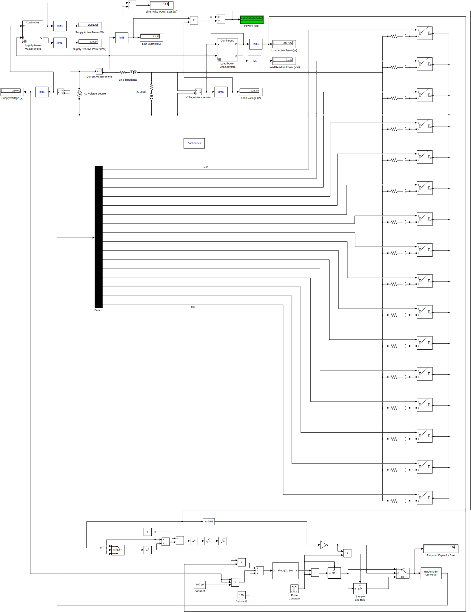

# Automatic-Power-Factor-Correction-System
Adaptive Automatic Power Factor Correction (APFC) system designed to reduce power losses caused by poor power factor using an adaptive, digitally controlled capacitor bank. Includes system concept, simulation model, and project documentation.

## 📌 Project Overview
This project presents the design and simulation of an **Adaptive Automatic Power Factor Correction (APFC) system** developed as part of the **EE3204 – Engineering System Design** module at the **University of Moratuwa**.

The objective of the project is to reduce **power losses caused by poor power factor** in electrical installations by implementing an adaptive, digitally controlled reactive power compensation scheme.

## 🎯 Objectives
- Analyze the impact of poor power factor on power losses and system efficiency
- Design an adaptive APFC system capable of operating under varying load conditions
- Improve system power factor close to unity
- Reduce line current and associated I²R losses
- Validate system behavior through simulation

## 🛠️ Proposed System Concept
The proposed APFC system continuously monitors the system power factor and compensates reactive power using a **binary-weighted capacitor bank** controlled by digital logic.

Key elements include:
- Real-time power factor measurement
- Adaptive control logic for capacitor switching
- Fine-grained reactive power compensation
- Scalable design suitable for commercial and industrial applications

## 💻 Simulation
A Simulink model was developed to evaluate the performance of the proposed APFC system under varying load conditions.

  

The simulation demonstrates:
- Improvement of power factor from low values (~0.75–0.80) to near unity (~0.98–1.00)
- Reduction in line current after compensation
- Improved overall system efficiency

## 📊 Key Features
- Adaptive power factor correction
- Digitally controlled capacitor bank
- Reduced power losses and improved voltage regulation
- Simulation-based performance validation
- Modular and scalable system design

## 📁 Repository Contents
- `/report` – Final project reports (PDF)

## 🧠 Skills & Technologies
- Power Systems Engineering
- Power Factor Correction
- Reactive Power Compensation
- MATLAB / Simulink (Simulation)
- Engineering System Design

## 📄 Project Report
The complete project report includes:
- Problem analysis
- System design details
- Project execution and management
- Results, challenges, and future work

## 👤 Authors
**Janindu Sathsara**  
Undergraduate – Electrical Engineering  
University of Moratuwa

**Manusha Thiwankara**  
Undergraduate – Electrical Engineering  
University of Moratuwa

**Hasindu Nimesh**  
Undergraduate – Electrical Engineering  
University of Moratuwa

## 📜 License
This project is intended for academic and educational purposes.
